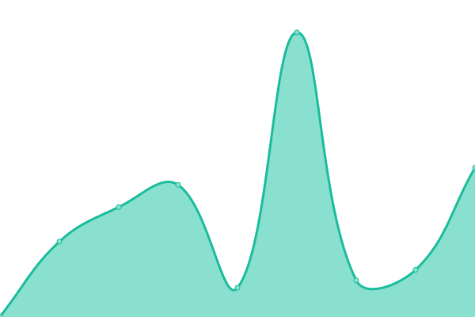

# [📈 Live Status](https://Foca-Software.github.io/status): <!--live status--> **🟩 All systems operational**

This repository contains the open-source uptime monitor and status page for [Foca-Software](https://Foca-Software.github.io/status), powered by [Upptime](https://github.com/upptime/upptime).

With [Upptime](https://upptime.js.org), you can get your own unlimited and free uptime monitor and status page, powered entirely by a GitHub repository. We use [Issues](https://github.com/Foca-Software/status/issues) as incident reports, [Actions](https://github.com/Foca-Software/status/actions) as uptime monitors, and [Pages](https://Foca-Software.github.io/status) for the status page.

<!--start: status pages-->
<!-- This summary is generated by Upptime (https://github.com/upptime/upptime) -->
<!-- Do not edit this manually, your changes will be overwritten -->
<!-- prettier-ignore -->
| URL | Status | History | Response Time | Uptime |
| --- | ------ | ------- | ------------- | ------ |
|  [Autogestión Clientes](https://sacautogestion.focasoftware.com/index) | 🟩 Up | [autogestion-clientes.yml](https://github.com/Foca-Software/status/commits/HEAD/history/autogestion-clientes.yml) | 

 3162ms
     
 | 

<a href="https://status.focasoftware.com/history/autogestion-clientes">98.44%</a>
    

|  [Receptor](https://receptordebocloud.debo-cloud.com/api-recepcion/test) | 🟩 Up | [receptor.yml](https://github.com/Foca-Software/status/commits/HEAD/history/receptor.yml) | 

 640ms
     
 | 

<a href="https://status.focasoftware.com/history/receptor">100.00%</a>
    

|  [Backend Mercado Pago Foca](http://mp.focasoftware.com/webservices/testFront) | 🟩 Up | [backend-mercado-pago-foca.yml](https://github.com/Foca-Software/status/commits/HEAD/history/backend-mercado-pago-foca.yml) | 

 2188ms
     
 | 

<a href="https://status.focasoftware.com/history/backend-mercado-pago-foca">99.78%</a>
    

|  [Backend Mercado Pago v2 Foca](https://mercadopagocloud.focasoftware.com/mercadopago/message-alive) | 🟩 Up | [backend-mercado-pago-v2-foca.yml](https://github.com/Foca-Software/status/commits/HEAD/history/backend-mercado-pago-v2-foca.yml) | 

 1148ms
     
 | 

<a href="https://status.focasoftware.com/history/backend-mercado-pago-v2-foca">100.00%</a>
    

|  [Backend Puma Foca](https://pumacloud.focasoftware.com/puma/message-alive) | 🟩 Up | [backend-puma-foca.yml](https://github.com/Foca-Software/status/commits/HEAD/history/backend-puma-foca.yml) | 

 576ms
     
 | 

<a href="https://status.focasoftware.com/history/backend-puma-foca">100.00%</a>
    

|  [Backend Central Info Foca](https://centralinfo.focasoftware.com/message-alive) | 🟩 Up | [backend-central-info-foca.yml](https://github.com/Foca-Software/status/commits/HEAD/history/backend-central-info-foca.yml) | 

 509ms
     
 | 

<a href="https://status.focasoftware.com/history/backend-central-info-foca">100.00%</a>
    

<!--end: status pages-->

[**Visit our status website →**](https://Foca-Software.github.io/status)

## 📄 License

- Powered by: [Upptime](https://github.com/upptime/upptime)
- Code: [MIT](./LICENSE) © [Foca-Software](https://Foca-Software.github.io/status)
- Data in the `./history` directory: [Open Database License](https://opendatacommons.org/licenses/odbl/1-0/)
